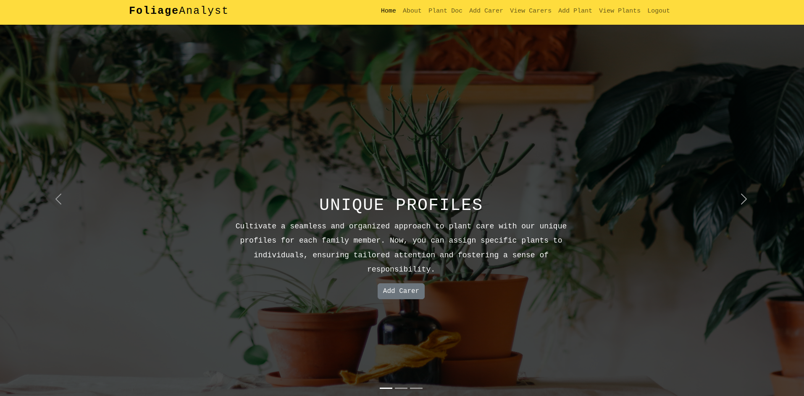

# Foliage Analyst

  

Deployed site a work in progress

 
This web-based application provides a centralized database that: 

- utilizes a PostgresSQL database
- is built with Python via the Django framework 

The application performs user centric CRUD (Create, Read, Update, Delete).

## About the Web App

Welcome to Mayday Mum – your trusted Northern Beaches destination for overnight nannying services. 

We understand that every parent needs a helping hand, especially during those long nights. Our fixed nightly fee covers a full 12 hours of dedicated support, so you can rest easy knowing your little ones are in caring hands. 

Join our Mayday Mum family today, and let us make your nights more peaceful and your mornings brighter.

## User stories
- I want to add, edit and delete a carer
- I want to add, edit and delete a plant
- I want to see all the plants in my care
- I want to see the individual details of each plant
- I want to associate a carer with an a plant so I know who is looking after that plant
- I want to associate a feeding to a plant so I know how much water / food it is getting 
- I want a flag to be able to see if my plant needs attention eg hasn't been fed in 7 days

## Features
- View a list the available plants or carers
- View/add/update plants or carers in your household
- View plant care advice (coming soon)
- Log in (coming soon)
- Log out (coming soon)
- Sign up (coming soon)

## Data Relationship

<!--  

  -->
 
1:M
- plant to feedings
 
1:M
- plants to carers   

<!-- 

## Screengrabs
| Logon View                                                                     | Sign Up View                                                                                    | Account View - Parent                                                                       | Find a nanny view                                                    |
| ------------------------------------------------------------------------------ | ------------------------------------------------------------------------------------------------ | ------------------------------------------------------------------------------------- | ---------------------------------------------------------------------- |
|  |  |  |  |

 -->

## Technologies Used

